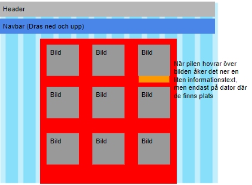
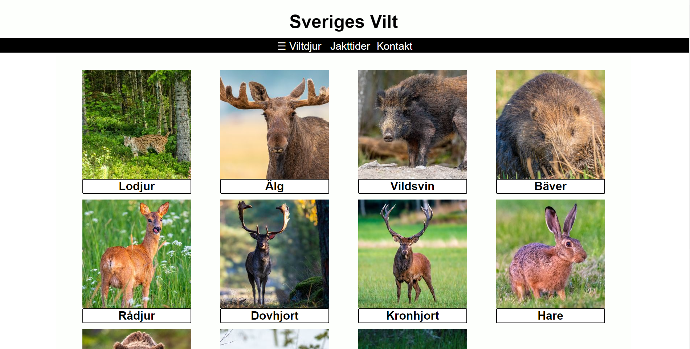
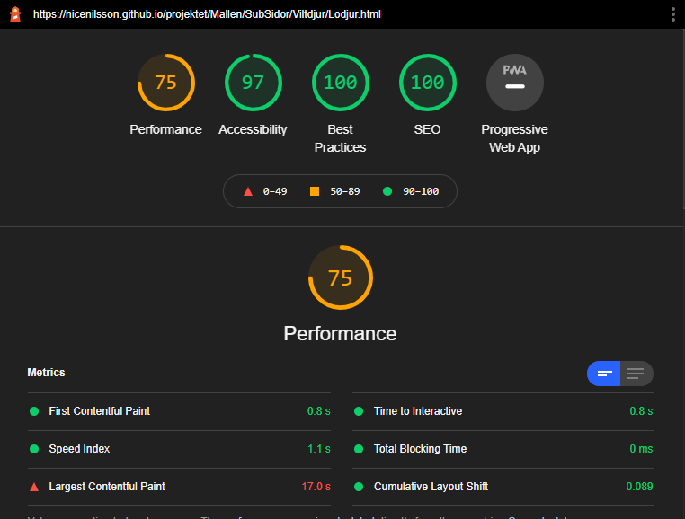
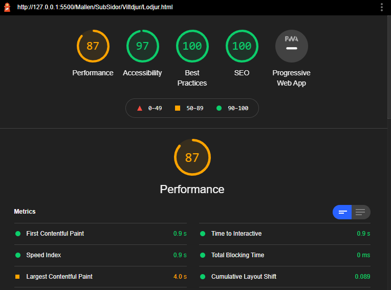

# projekt

## Sammanfattning

Detta projekt är för en hemsida vars syfte är att informera jägare och vuxna fritidsuppskattare om ett utval av sveriges vilt. Projektet inleddes 2021-03-22, och koden blev klar 2021-05-23, alltså ungefär 2 månaders tid från idé till färdig produkt. Hela projektets gång går att följa i dess dagbok, som ligger under wiki på dess github-sida. Projektet inleddes med planering, och gick sedan över till att få en passande layout. Layouten har testats och tagit emot kritik så att den blev så bra som möjligt.  Layouten var klar i stora drag efter första månaden av arbete, och content blev klar under andra delen av arbetet. Avslutningsvis validerades och finlirades sidan, samt testades genom simulering. Bilder kom med tillåtelse från Torleif Nilsson, viltfotograf. 

## Planering

Första planeringen av hemsidan på stor skärm: 

Slutgiltiga versionen av sidan på stor skärm:

Som det syns så är slutsatsen rätt så lik planeringen, men inte exakt. Navbaren dras inte ned och upp, utan är statisk, och istället finns det en sidebar som används för att röra sig runt på sidan utöver ordinarie länkar. När man hovrar över bilderna kommer ingen dropdown meny, utan bildan markeras bara och texten lyser grön. Detta eftersom jag upplevde att dropdown menyer skulle bli jobbigt för användaren om man t.ex. drog musen över flera bilder samtidigt, och alla dessa skulle blinka till och text skulle komma upp. Det finns även en footer. I framtiden bör jag dock gå tillbaka och ändra planeringen efter att jag reviderar den, och inte endast revidera planeringen i mitt huvud. Detta fungerar ok då jag arbetar själv, men skulle det vara så att jag jobbar på ett projekt med flera andra personer bör även de få veta hur planeringen ändras så de inte förändrar mina ändringar och det blir mer jobb.

## Innehåll och navigering

Hemsidans innehåll är främst information om de olika viltdjuren. detta innehåll följer en mall för varje djur, där det börjar med att berätta om djurets kännetecken, sedan matvanor och diet och till sist parning och beteende. Det finns även en sida som visar simplifierat vilka jakttider som finns för djuren. Anledning till att denna är simplifierad är för att det helt enkelt inte finns plats nog för att skriva varje läns lagar och regler. 

Man kan alltid ta sig från den sidan man är på till startsidan genom att trycka på "Sveriges vilt" högst upp. Man kan även ta sig till alla viltdjurssidorna genom att trycka på "Viltdjur" i navbaren, som öppnar upp en sidebar som drivs av javascript.

## Validering och hastighet

Samtliga sidor har validerats på flera sätt. 

All HTML har validerats genom [W3C HTML validator](http://validator.w3.org/), [Validator.nu](https://validator.nu/) och [W3C Unicorn validator](http://validator.w3.org/unicorn/). 

CSS har validerats genom [W3C CSS validator](http://validator.w3.org/unicorn/). 

Javascript har validerats genom [BeutifyTools.com](https://beautifytools.com/javascript-validator.php)

Alla bilder har komprimerats genom [TinyPNG]((https://tinypng.com/).) för att göra hemsidan snabbare.

Hemsidan har även testats genom lighthouse. 

Före bilder komprimerades såg lighthouse testet ut såhär:

Efter bilder komprimerades såg lighthouse testet ut såhär:

Alltså fick komprimeringen en effekt på hastigheten av sidan.

Hemsidan har testats på många olika upplösningar genom "inspect" verktyget på chrome, men har även testats på fysiska enheter. Detta inkluderar men är inte begränsat till: Samsung s9+, 24" skärm, 27" skärm, 32" TV, 55" TV, Macbook och ipad 2.

Hemsidan har även testats på google chrome, microsoft edge och mozilla firefox.

## Riktlinjer och simulering

Under programeringens gång har riktlinjer försökt följas, och har även manuellt testats. Hemsidan har även testats genom [Powermapper](https://try.powermapper.com/demo/Report/d801fa2a-ae5f-49db-b33d-6f93ab87ad96), som validerar, testar och ser till så att sidan uppfyller standards, samt testar tillgänglighet. Många fel hittades genom powermapper, men dessa jobbades bort och löstes. Nu återstår bara två problem, vilket är att internet explorer inte har css grid egenskapen, vilket inte riktigt kan lösas då hela sidan är baserad på css grid, samt att sidans länkar är för långa, vilket inte går att ändras då jag använder github pages som webbhotel, och jag inte har ett eget custom domain namn. Sidan har även simulerats genom [Browserstack](https://www.browserstack.com/), för att testa så att den fungerar på olika sidor och browsers.

## Upphovsrätt och lagar

Upphovsrätt betyder att den som skapar ett verk av något slag har rätten att bestämma hur och var detta verk används. Upphovsrätt uppstår så fort du skapar något originellt, och gäller fram tills 70 år efter din död. Källa[Fortnox.se](https://www.fortnox.se/fortnox-foretagsguide/ekonomisk-ordlista/upphovsratt/)

Upphovsrätt betyder att du som skapar något alltid har rätt att bestämma var och hur det får användas, samt har rättighet till att du blir angiven som upphovsman, och att du har en ekonomisk rätt till verket, vilket betyder att du har rätt till ersättning om det skulle vara så att verket används inom försäljning och för kommersiella bruk. 

På denna hemsida används endast information från wikipedia, och vid ett fall [Jakttider.se](https://jakttider.jagarnasriksforbund.se/) som man härledes till om man går in på sidan "Copyright". Bilder har använts med samtycke av Torleif Nilsson, och namn och mail har med samtycke skrivits på "Copyright" sidan. 

1 §   Näringsidkare får icke vid marknadsföring av vara, tjänst eller annan nyttighet använda framställning i vilken annans namn eller bild utnyttjas utan dennes samtycke. Med namn jämställs annan beteckning som klart utpekar viss person. [Riksdagen.se](https://www.riksdagen.se/sv/dokument-lagar/dokument/svensk-forfattningssamling/lag-1978800-om-namn-och-bild-i-reklam_sfs-1978-800)

Straffet för att bryta denna lag kan vara böter, skadestånd, tvingad förändring av reklam, tjänst eller vara för att utlämna namn och bild.

Ett fall då någon blivit fälld för detta är när en bloggare användes annans bild i sin blogg utan tillåtelse från upphovsrättsmannen, och genom att göra den tillgänglig till allmänheten gjorde sig bloggaren skyldig till upphovsrättsintrång.[ktnt.se](https://www.kntnt.se/vad-galler-for-anvandning-av-bilder-pa-internet/18509)

### Egna tankar och problematik

I mitt fall gäller inte några av dessa lagar, och det uppstår inte så mycket problem. Men hade det varit så att min hemsida handlade om stadsarkitektur t.ex. så måste jag vara försiktig då vid bildtagning kanske jag fick med andra personers ansikte, eller annan identifierande information som reg-skyltar. I detta fall skulle jag ha två val, antingen redigera bilderna och sudda ut ansikte och identifierande information, eller fråga människorna i bilden om de tillåter mig att använda deras bilder. Detta kanske inte är en möjlighet när man kan ha 12 bilder, varav varje bild har 30+ människor i sig, och därmed blir det första valet mer attraktivt. Jag har ju såklart alltid valet att använda deras ansikte utan att fråga, men då kan det bli problem med lagar som nämnts under "Upphovsrätt och lagar", och det är inte heller så lockande.

Mina egna tankar runt upphovsrätt är att det är bra att människor har rättighet att äga sina bilder, lite som på samma sätt en konstnär äger de konstverk de skapar, bör en onlinekonstnär eller fotograf äga sina egna konstverk. Jag anser dock att en för expansiv upphovsrätt kan leda till förluster i kulturarvet, då människor kan säga sig äga saker som bör vara tillåtet för alla att se och använda. Om t.ex. ett livsräddande vaccin skulle komma ut tror jag dock att alla borde få information hur man producerar och återskapar det, istället för att någon kan tjäna grova pengar på att sälja det med grovt inflaterade priser då de har monopol på det.

Det är helt enkelt en gråzon, men jag tycker det i allmänhet är bra med upphovsrätt, och hur det blir allmän ägo 70 år efter en persons död.

## Tredjepartskod

Den kod jag använt är då jag skapat sidan är endast [w3schools.com](https://www.w3schools.com/howto/howto_js_collapse_sidebar.asp) guide på hur man skapar en collapsed sidebar, och där gick jag igenom koden och följde guiden, så jag vet vad för kod det är och vad den gör, samt att den inte är skadlig. 

Faran med att använda annans kod, speciellt då man bara copy/pastar utan att faktiskt läsa igenomen koden, eftersom den kod man kopierar kan innehålla skadlig kod som kan samla information om servern, DDOS:a sidan eller göra så att webbplatsen inte fungerar. Detta är extra viktigt då man har kunder som lämnar ut känslig information till din sida, och du har ett ansvar att skydda informationen.

## Val av webbhotel

Vid val av webbhotel är det viktigt att man väljer ett bra, pålitligt webbhotel, av många anledningar. För det första, är det viktigt att sidan är snabb att använda, och att den har en hög uptime. Det är inge kul om din sida inte går att kolla på halva tiden. Det blir även inge kul då din sida inte kommer att rekomenderas av googles algoritmer. För vem kollar verkligen på den andra sidan av google?

Man bör även se till så att sidan har bra nivå av lagring som passar din egen sida. En annan fallgrop med webbhotell är att vissa av dem har en månaktlig traffikgräns, som gör att du antingen måste betala mer då gränsen överskrids, eller bara sluta att visa din sida.

En av de viktigaste sakerna med att välja webbhotel är att hotelet ska vara pålitligt, samt försäkra dig och dina kunder att er information är säker. Man bör även se till att hotelet har bra customer support. 

[rockcontent.com](https://rockcontent.com/blog/how-to-choose-a-web-host/)

## Teckenkodning

UTF-8 används då det kan supporta många språk och är effektivt på att spara tecken. Problem som kan uppstå då man inte använder UTF-8 är att sidan blir svårläslig för utlänningar som försöker läsa t.ex. "Ä", men istället får de &.#228; (ignorera punkten mellan & och #, måste ha så annars blir det bara ett Ä). Sidan kan även bli långsam om man inte använder UTF-8.